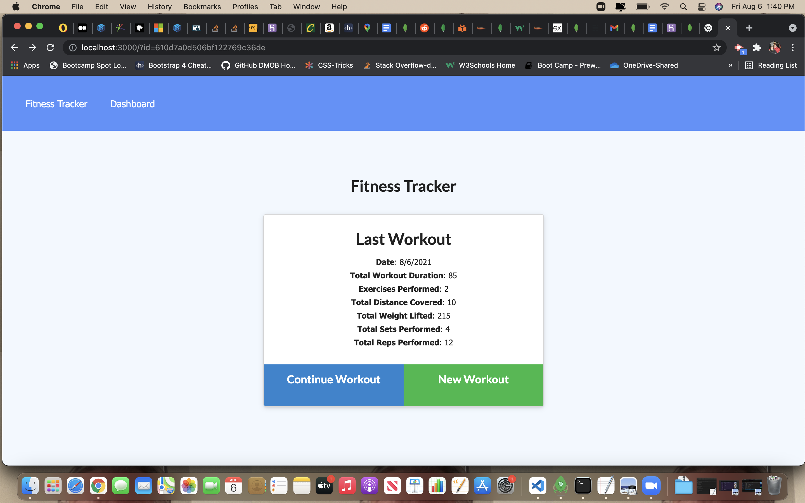
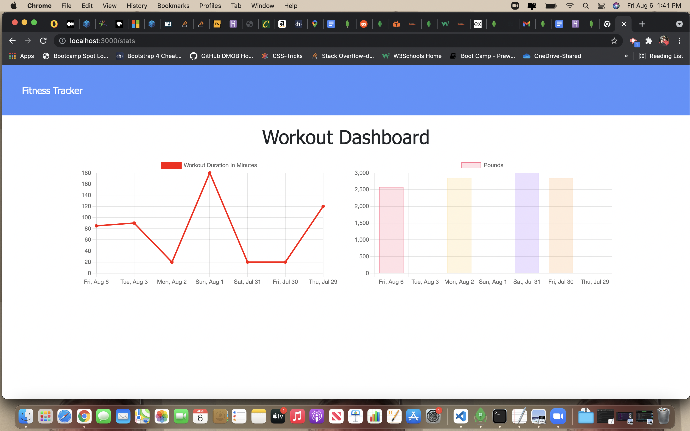

# hw18-workout-tracker

## Table of Contents
1. [General Info](#general-info)
2. [Screenshot](#screenshot)
3. [Technologies](#technologies)
4. [Usage](#usage)
5. [FAQs](#faqs)

### General Info
***
### David OBrien's Workout Tracker

Workout tracker allows user to track daily workouts, and to create new workouts or
add exercises to the current workout. Workout tracker presents average and accumulated
workout durations over specified time period. Get in shape faster withh workout tracker!

### Screenshots

## Technologies
***
A list of technologies/patterns used within the project:
  * node.js
  * express server
  * express routes - api
  * javascript
  * mongodb database
  * mongodb atlas hosting
  * Postman - used to streamline testing of api routes
  * Heroku - web hosting

## Usage
***

Link to github repository- https://github.com/dmobrienllc/hw18-workout-tracker

Link to deployed app- https://floating-reef-04864.herokuapp.com/

## FAQs
***

Q Is this application awesome?

A Why yes it is!
---
